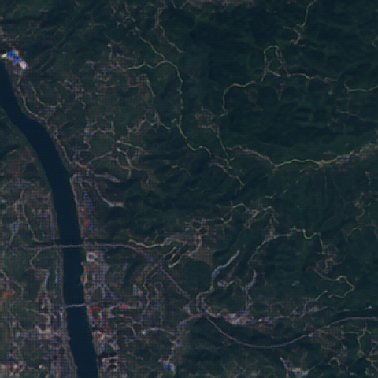

# ESRGAN-PyTorch: Super-Resolution for Satellite Imagery

Welcome! This project provides a PyTorch implementation of the Enhanced Super-Resolution Generative Adversarial Network (ESRGAN), specifically tailored for enhancing the resolution of satellite imagery. If you're looking to upscale your remote sensing data, you're in the right place.

## Dataset

This model is designed to be trained on a dataset of high-resolution images. During training, low-resolution counterparts are created on-the-fly. For optimal results, use a dataset like **OLI2MSI**, which can be found here: [Kaggle - OLI2MSI](https://www.kaggle.com/datasets/nexuswho/oli2msi)

After downloading, you should have a directory containing your high-resolution training images.

## Getting Started

1.  **(Optional) Create a virtual environment:**
    ```bash
    python -m venv venv
    # On Windows:
    venv\Scripts\activate
    # On Linux/Mac:
    source venv/bin/activate
    ```

2.  **Install the required Python packages:**
    ```bash
    pip install -r requirements.txt
    ```

## Project Components

This project includes several Python scripts, each with a specific function. Here's a breakdown:

### 1. `esrgan.py`

The main training script for the ESRGAN model. It handles:

-   Loading the high-resolution image dataset.
-   Building the generator and discriminator models.
-   Training the models using a combination of content, perceptual, and adversarial losses.
-   Saving model checkpoints and sample output images during training.

### 2. `esrgan_finetune.py`

A script for fine-tuning a pre-trained ESRGAN generator. This is useful for adapting the model to a new dataset without starting from scratch. It:

-   Loads a pre-trained generator model.
-   Continues training on a new dataset, often with a lower learning rate.

### 3. `test_image.py`

A script for testing and evaluation. It:

-   Loads a trained generator model.
-   Takes a low-resolution image as input.
-   Generates and saves a high-resolution output image.

### 4. `model.py`

This script defines the architecture of the ESRGAN models:

-   **Generator**: Built with Residual-in-Residual Dense Blocks (RRDBs) for deep feature extraction.
-   **Discriminator**: A VGG-style network that distinguishes between real and generated high-resolution images.
-   **FeatureExtractor**: A pre-trained VGG19 network used to compute the perceptual loss.

### 5. `dataset.py`

This script contains the data loading and preprocessing utility:

-   Defines the `ImageDataset` class for PyTorch.
-   Handles image transformations, such as resizing, cropping, and normalization.

### 6. `utils.py`

This script provides common utility functions for the project:

-   A learning rate scheduler (`LambdaLR`) that decays the learning rate over time.
-   Functions for saving and handling images.

## Training the Model

To train the ESRGAN model from scratch, run `esrgan.py`. You can customize the training process with the following parameters:

```bash
python esrgan.py --dataset_path <path_to_your_hr_images> --epochs 200 --batch_size 4
```

**Training Parameters:**
- `--dataset_path`: Path to the directory containing your high-resolution training images.
- `--epochs`: Number of training epochs (default: 200).
- `--batch_size`: The size of each training batch (default: 4).
- `--lr`: The learning rate for the optimizer (default: 0.0002).
- `--b1`, `--b2`: Adam optimizer coefficients (defaults: 0.9, 0.999).
- `--n_cpu`: Number of CPU threads to use for data loading (default: 8).
- `--hr_height`, `--hr_width`: The high-resolution dimensions for training (defaults: 256, 256).
- `--channels`: Number of image channels (default: 3).
- `--sample_interval`: The interval between saving sample images (default: 100).
- `--checkpoint_interval`: The interval between saving model checkpoints (default: 100).

## Fine-Tuning the Model

To fine-tune a pre-trained model, use `esrgan_finetune.py`. This is ideal for adapting the model to a new dataset.

```bash
python esrgan_finetune.py --dataset_path <path_to_your_hr_images> --generator_checkpoint <path_to_generator.pth>
```

**Fine-Tuning Parameters:**
- `--dataset_path`: Path to the new high-resolution dataset for fine-tuning.
- `--generator_checkpoint`: Path to the pre-trained generator model (`.pth` file).
- Other parameters are similar to `esrgan.py` and can be adjusted as needed.

## Testing with a Trained Model

Once you have a trained generator, you can use it to upscale a single low-resolution image with `test_image.py`:

```bash
python test_image.py --image_path <path_to_lr_image> --generator_checkpoint <path_to_generator.pth>
```

**Testing Parameters:**
- `--image_path`: Path to the low-resolution input image.
- `--generator_checkpoint`: Path to the trained generator model (`.pth` file).
- `--channels`: Number of image channels (default: 3).

The output image will be saved in the `output` directory.

## Image Comparison

The ESRGAN model takes a low-resolution (LR) image (120x120) and generates a super-resolved (SR) version at 4x the resolution (480x480). Below is a comparison of the LR input, the SR output, and the original high-resolution (HR) ground truth.

### Example 1
| Low-Resolution (120x120) | Super-Resolution (480x480) | High-Resolution (Ground Truth) |
|:---:|:---:|:---:|
|  |  |  |

### Example 2
| Low-Resolution (120x120) | Super-Resolution (480x480) | High-Resolution (Ground Truth) |
|:---:|:---:|:---:|
|  |  |  |

---

If you use this code, please consider giving credit to the original ESRGAN authors and this repository. Questions or suggestions? Feel free to open an issue or contribute!

## References

This implementation is based on the original ESRGAN paper and heavily references the following public repository. We extend our gratitude to the authors for their excellent work.

- **ESRGAN-Pytorch by lizhuoq**: [https://github.com/lizhuoq/ESRGAN-pytorch](https://github.com/lizhuoq/ESRGAN-pytorch)
